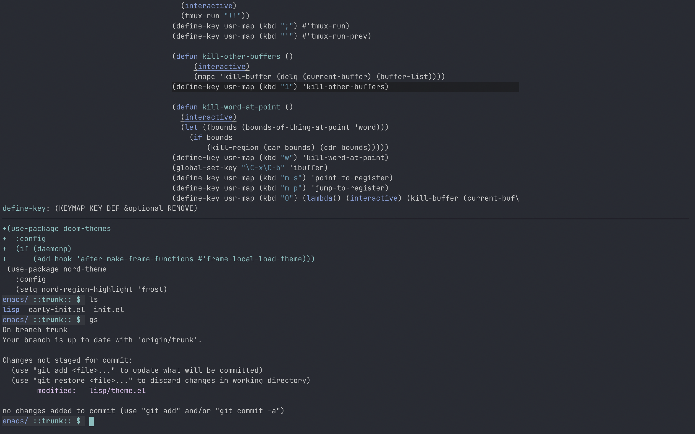
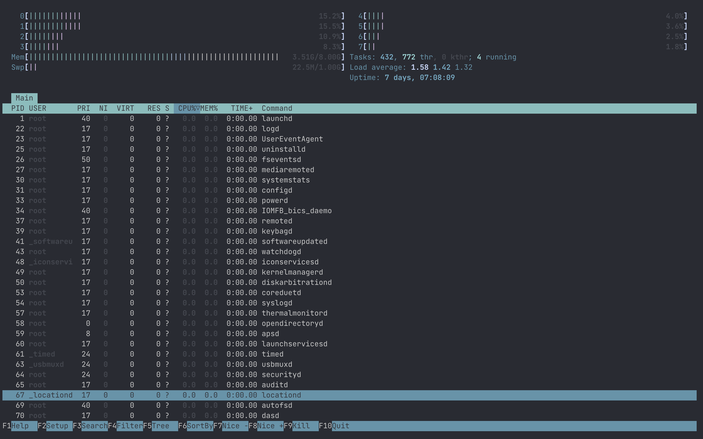

 # Wilmersdorf iTerm2

 

 **A dark [iterm2](https://iterm2.com/) theme - based on emacs [wilmersdorf](https://github.com/ianyepan/wilmersdorf-emacs-theme).**
 
 ---
 
  
 

## Getting Started

> **To emulate the full environment shown in the screenshots, [try my dotfiles](https://github.com/sayeefm0/dotfiles)**

1. Download `wilmersdorf.itermcolors`
2. Open **iTerm2** -> **Preferences** -> **Profiles** -> **Colors**
3. Select the **Color Presets** dropdown -> scroll down to **Import**
4. Import the `.itermcolors` file
5. Select the **Color Presets** dropdown -> select `wilmersdorf`

## Screenshots

 

 emacs (top-pane) vs term (bottom-pane)

 

 htop

 
 

